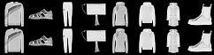

# Dynamic VAE

<p align="center">
  
</p>

A Variational Autoencoder (VAE) incorporating residual connections and self-attention mechanisms for enhanced image generation and reconstruction.

## ✨ Features

- **Dynamic Architecture:** Easily configure encoder/decoder channel depths.
- **Residual Blocks:** Improves training stability and feature propagation in deep networks.
- **Self-Attention:** Captures long-range dependencies for improved image coherence.
- **Perceptual Loss:** Leverages VGG features for visually superior reconstructions.
- **WandB Integration:** Seamless experiment tracking and visualization.
- **Multi-GPU Support:** Utilizes `torch.nn.DataParallel` for accelerated training.

## 🚀 Getting Started

### Prerequisites

- Python 3.x
- PyTorch

### Installation

```bash
git clone https://github.com/yourusername/your-vae-repo.git
cd your-vae-repo
pip install -r requirements.txt
```

## 🛠 Usage

### Training

To train the model, prepare your dataset as specified in dataset.py and run:

```bash
python train.py --config configs/default_config.json
```

Example configs/default_config.json:

```json
{
  "input_height": 128,
  "input_width": 128,
  "encoder_channels": [32, 64, 128, 256],
  "decoder_channels": [256, 128, 64, 32],
  "latent_dim": 512,
  "batch_size": 128,
  "lr": 1e-3,
  "weight_decay": 1e-5,
  "grad_clip": 1.0,
  "epochs": 100,
  "data_path": "./data/your_images",
  "image_mode": "grayscale",
  "log_interval": 10,
  "image_log_interval": 15,
  "project_name": "VAE-Training",
  "tags": ["grayscale", "beta-vae"],
  "save_dir": "./vae_checkpoints",
  "use_dataparallel": true,
  "num_workers": 4,
  "perceptual_weight": 0.1,
  "kld_weight": 0.5
}
```
